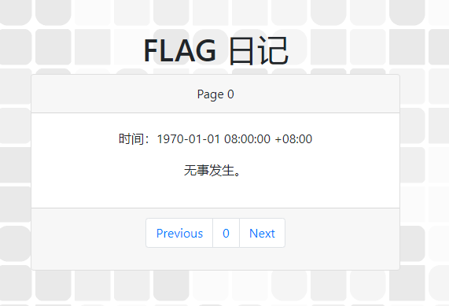
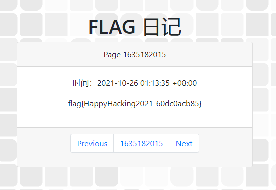

## 签到

> 为了能让大家顺利签到，命题组把每一秒的 flag 都记录下来制成了日记本的一页。你只需要打开日记，翻到 Hackergame 2021 比赛进行期间的任何一页就能得到 flag！

点击 `Next` ，发现跳转到了 `http://202.38.93.111:10000/?page=1` ，页面上的时间也增加了一秒。

结合题干以及1970年1月1日这个特殊的时间节点，可以推得page后面接的应该是Unix时间戳。

随便搜个在线工具，把现在的时间戳替换上去（单位：秒），如 `http://202.38.93.111:10000/?page=1635182015` ，得到flag：

