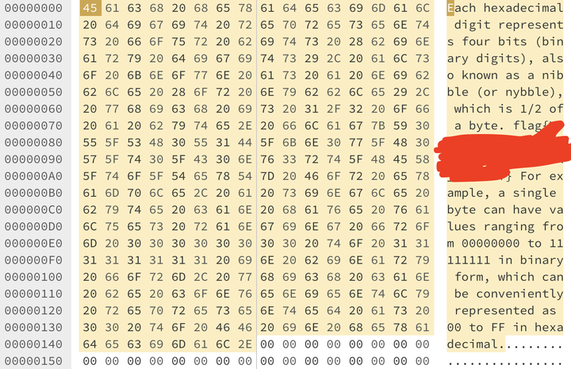
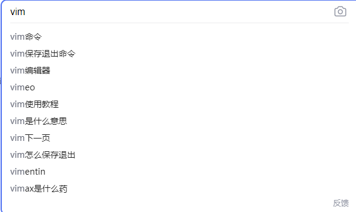
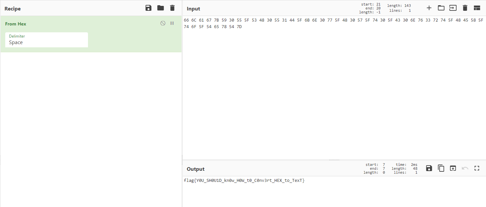

# 进制十六——参上

> 为严防 flag 泄漏以及其他存在于未来所有可能的意外灾难，神通广大的 Z 同学不仅强制要求每一道题目都加上权限和资源的限制，还给所有参与 Hackergame 2021 命题的计算机施加了一层法术结界。任何试图从结界逃逸的 flag 都会被无情抹除。 
>
> 而一位明面上是计算机学院的新生，实则为物理学院暗部核心成员的 X 同学，在 Hackergame 2021 命题组已经潜伏多时。妄想趁比赛开始的午时，借阳火正旺之势，冲破 Z 同学的结界，以图片而非明文的形式，将 flag 悄悄传递出来。 
>
> 好在 Z 同学法力之深厚，不可管窥蠡测。在 flag 被传出去的前两天，就已预知此事并将图片中的 flag 无声消泯了。 
>
> 只是，这位 X 同学，虽然不会退出 Vim，但是似乎对打开十六进制编辑器颇有造诣……



题中neta了vim的退出梗——几乎每个vim新用户都会去搜索的问题：



这里直接使用iOS15自带的ocr功能（不会真有人手打吧？不会吧不会吧？）：

```
66 6C 61 67 7B 59 30 55 5F 53 48 30 55 31 44 5F 6B 6E 30 77 5F 48 30 57 5F 74 30 5F 43 30 6E 76 33 72 74 5F 48 45 58 5F 74 6F 5F 54 65 78 54 7D
```

扔到 [CyberChef](https://gchq.github.io/CyberChef/) 里，选择解码方式为 From Hex ：



得到 `flag{Y0U_SH0U1D_kn0w_H0W_t0_C0nv3rt_HEX_to_TexT} ` 。

