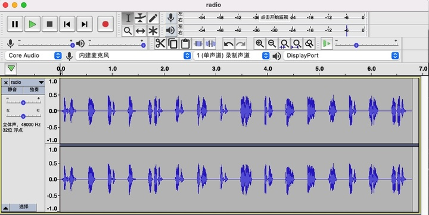

# 去吧！追寻自由的电波

> （前情提要） 为了打破 Z 同学布下的结界，X 同学偷偷搬出社团的业余无线电台试图向外界通讯。 
>
> 当然，如果只是这样还远远不够。遵依史称“老爹”的上古先贤的至理名言，必须要“用魔法打败魔法”。X 同学向上级申请到了科大西区同步辐射实验室设备的使用权限，以此打通次元空间，借助到另一个平行宇宙中 Z 同学的法力进行数据对冲，方才于乱中搏得一丝机会，将 flag 用无线电的形式发射了出去。 
>
> 考虑到信息的鲁棒性，X 同学使用了无线电中惯用的方法来区分字符串中读音相近的字母。即使如此，打破次元的强大能量扭曲了时空，使得最终接受到的录音的速度有所改变。 
>
> 为了保障同步辐射设备的持续运转，组织牺牲了大量的能源，甚至以东北部分地区无计划限电为代价，把这份沉甸甸的录音文件送到了你的手上。而刚刚起床没多久，试图抢签到题一血还失败了的你，可以不辜负同学们对你的殷切期望吗？ 
>
> 注：flag 花括号内只包含小写字母。

neta了成龙历险记和限电。另外没想到科大竟然也有同步辐射光源（察觉）。

下载下来是一个被变速了的MP3文件。直接去[Audacity官网](https://audacity.onl/)下载Audacity。

右上角变速：

随便拉一下，发现调到0.3倍速最合适（估计是原音频被调了3倍速）。

根据题目中 无线电中惯用的方法 ，显然是北约的那个字母表（[百度百科](https://baike.baidu.com/item/北约音标字母)），平常在一些纪录片中可以听到。 （终于有那么一点点crypto相关了）

对照字母表，男声朗读的单词是：

`Foxtrot Lima Alpha Golf LeftBracket Papa Hotel Oscar November Echo Tango India Charlie RightBracket`

因此flag是：

`flag{phonetic}`  。