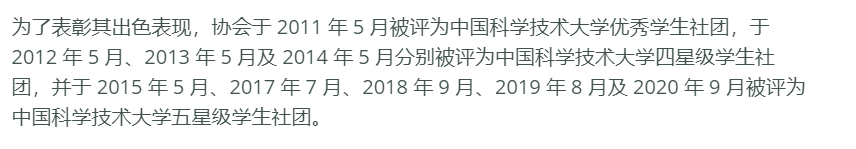
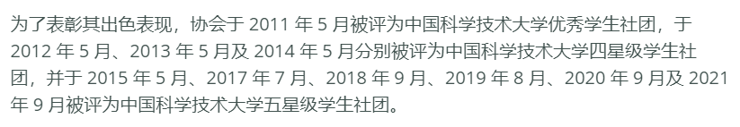
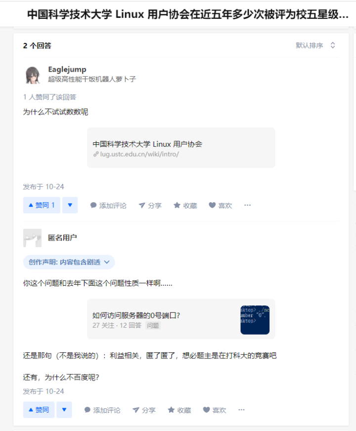
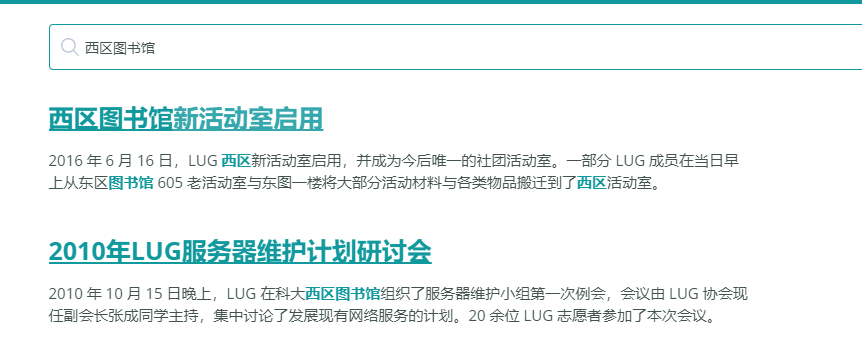
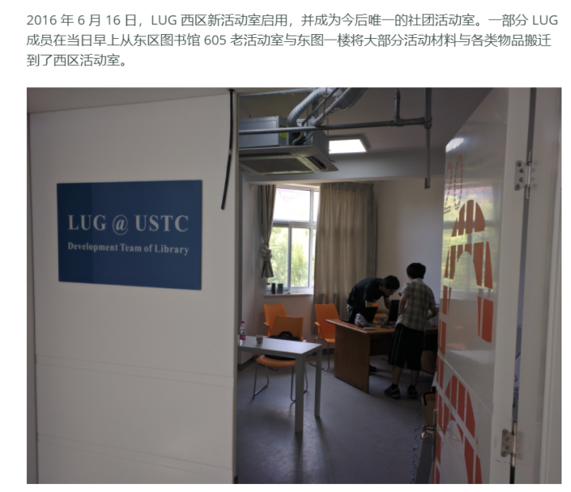
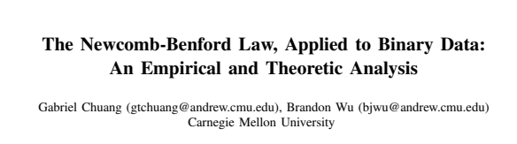

# 猫咪问答 Pro Max

> 我猛然一看，就猛然看到这个猫咪问答，我直呼我直呼，上次看到这么这么的发言还是上次，这问答属于是典型的典型了，我之前还没发现，当我发现的时候我已经发现了，这问答就像一个问答，问答的内容充满了内容，我不禁感慨了一句感慨：希望下次看到这么这么的猫咪问答是下次。

捏他 iPhone 和废话梗。

猫咪问答算是Hackergame传统艺能了。一共五道题。

## 第一题

> 1. 2017 年，中科大信息安全俱乐部（SEC@USTC）并入中科大 Linux 用户协会（USTCLUG）。目前，信息安全俱乐部的域名（[http://sec.ustc.edu.cn](https://link.zhihu.com/?target=http%3A//sec.ustc.edu.cn)）已经无法访问，但你能找到信息安全俱乐部的社团章程在哪一天的会员代表大会上通过的吗？
>    提示：输入格式为 YYYYMMDD，如 20211023。请不要回答 “能” 或者 “不能”。

这个提示就很爆笑（

找不到，留着爆破。

## 第二题

> 2. 中国科学技术大学 Linux 用户协会在近五年多少次被评为校五星级社团？
>    提示：是一个非负整数。

直接去翻中科大Linux 用户协会的[wiki](https://link.zhihu.com/?target=https%3A//lug.ustc.edu.cn/wiki/intro/)：



注意，现在是10月，有可能2021年9月也被评选为五星社团，而wiki还未更新。

所以答案是 `4` 或 `5` 。

*比赛结束后立马就加上了（果然是故意的）：*



另：

[中国科学技术大学 Linux 用户协会在近五年多少次被评为校五星级社团？](https://www.zhihu.com/question/494178119)



## 第三题

> 3. 中国科学技术大学 Linux 用户协会位于西区图书馆的活动室门口的牌子上“LUG @ USTC”下方的小字是？
>    提示：正确答案的长度为 27，注意大小写。

去LUG的官网搜 `西区图书馆` ：





得到答案 `Development Team of Library` 。

## 第四题

> 4. 在 SIGBOVIK 2021 的一篇关于二进制 Newcomb-Benford 定律的论文中，作者一共展示了多少个数据集对其理论结果进行验证？
>    提示：是一个非负整数。

搜索 `SIGBOVIK 2021` 得到一篇[论文集](https://link.zhihu.com/?target=http%3A//sigbovik.org/2021/proceedings.pdf)。

文内搜素 `Newcomb-Benford`，粗略地看了一遍，发现图2–14都是验证结果。



所以答案是 `13` 。

## 第五题

> 5. 不严格遵循协议规范的操作着实令人生厌，好在 IETF 于 2021 年成立了 Protocol Police 以监督并惩戒所有违背 RFC 文档的行为个体。假如你发现了某位同学可能违反了协议规范，根据 Protocol Police 相关文档中规定的举报方法，你应该将你的举报信发往何处？
>    提示：正确答案的长度为 9。

搜索 `Protocol Police IETF` ，得到[RFC8962](https://link.zhihu.com/?target=https%3A//datatracker.ietf.org/doc/html/rfc8962)。

粗略地读一遍：

> 6. Reporting Offenses
>    Send all your reports of possible violations and all tips about
>    wrongdoing to /dev/null. The Protocol Police are listening and will
>    take care of it.

得到答案为 `/dev/null` 。

## 爆破

接下来就是传统爆破环节了：

```python
import requests as r

if __name__ == '__main__':
    url = 'http://202.38.93.111:10001/'

    data = {
        'q1': '',
        'q2': 5,
        'q3': 'Development Team of Library',
        'q4': 13,
        'q5': '/dev/null'
    }
    header={
        'cookie': 'COOKIEEEEEEEEEE'
    }

    for y in range(2014, 2018):
        for m in range(1, 13):
            for d in range(1, 32):
                ys = str(y)
                ms = str(m).zfill(2)
                ds = str(d).zfill(2)
                data['q1'] = f'{ys}{ms}{ds}'

                print(data['q1'])
                s = r.session()
                _ = s.post(url, data=data, headers=header).text

                if '没有全部答对' not in _:
                    print(_)
                    input()
```

得到第一题答案 `20150504` 和 flag `flag{8804d9f3_1926ff4f72}` 。

