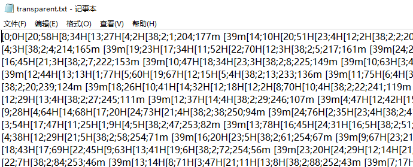

# 透明的文件

> 一个透明的文件，用于在终端中展示一个五颜六色的 flag。 
>
> 可能是在 cmd.exe 等劣质终端中被长期使用的原因，这个文件失去了一些重要成分，变成了一堆乱码，也不会再显示出 flag 了。 
>
> 注意：flag 内部的字符全部为小写字母。

打开长这样：



搜索了一下之后，发现是ANSI码（[wikipedia](https://en.wikipedia.org/wiki/ANSI_escape_code)）。得知格式应为 `\033[***` 。

`\033[**;**H`代表移动光标；`\033[38;2;**;**;**` 代表设置前景色，后接rgb；`\033[39m` 代表把前景色设为默认值。

于是用脚本补上 `\033` ，并将透明的空格改成方块：

```python
if __name__ == '__main__':
    import os
    os.system('cls')
    s = '[0;0H[20;58H[8;34H[13;27H[4;2H[38;2;1.............'
    s = s.replace('[', '\033[').replace(' ', '█')
    print(s)
```

输出：


`flag{abxnniohkalmcowsayfiglet}` 。