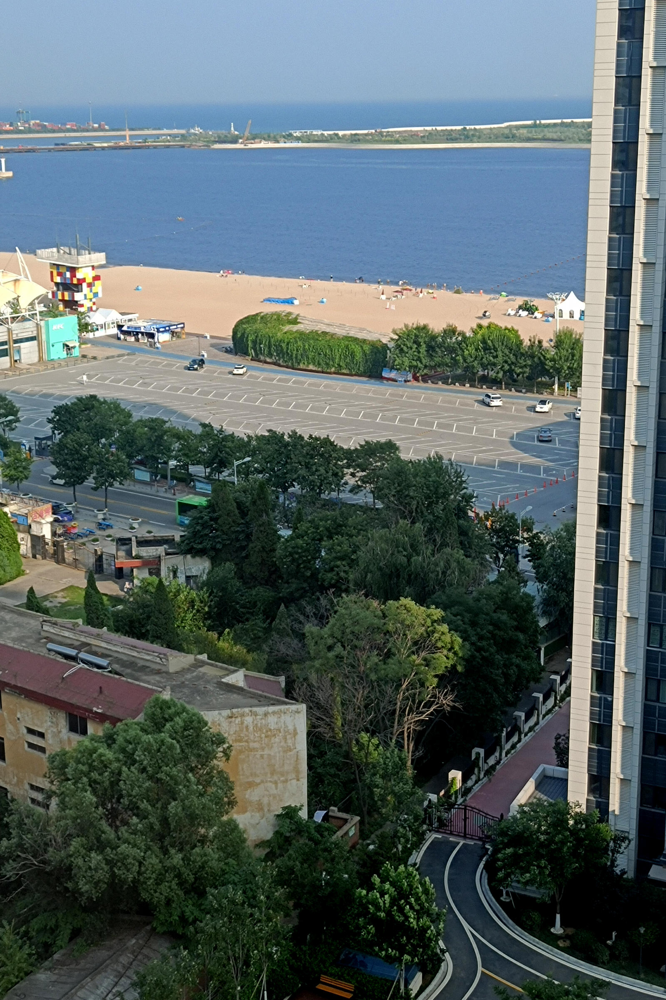
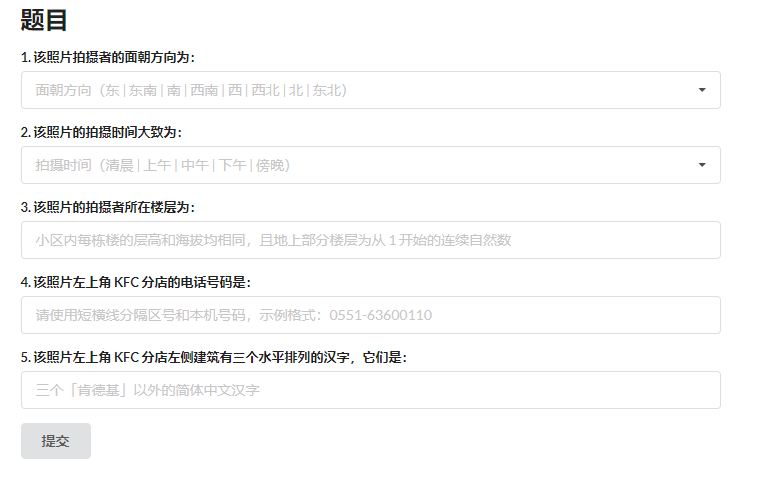
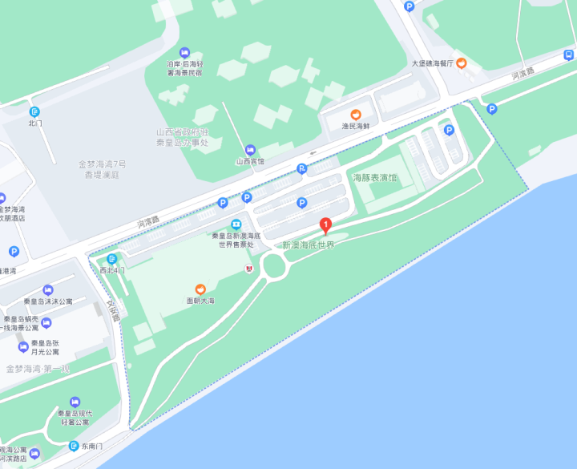
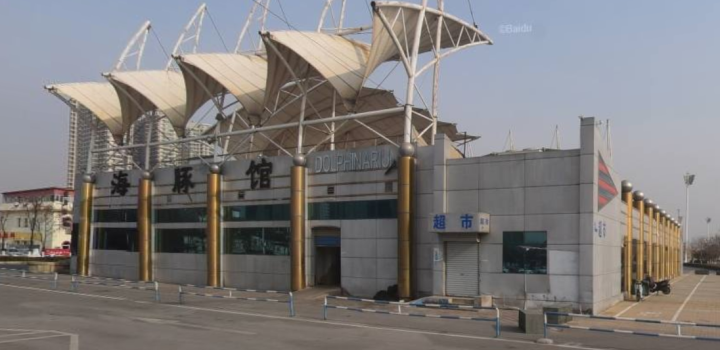
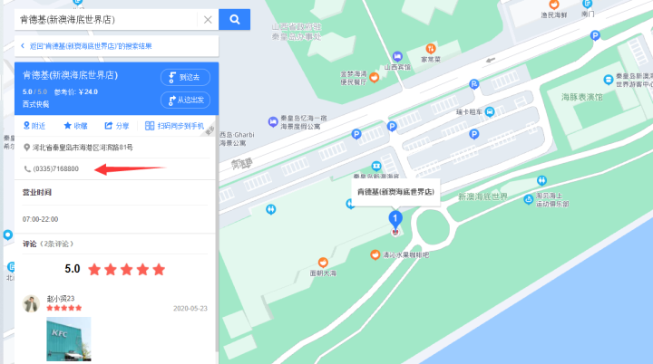
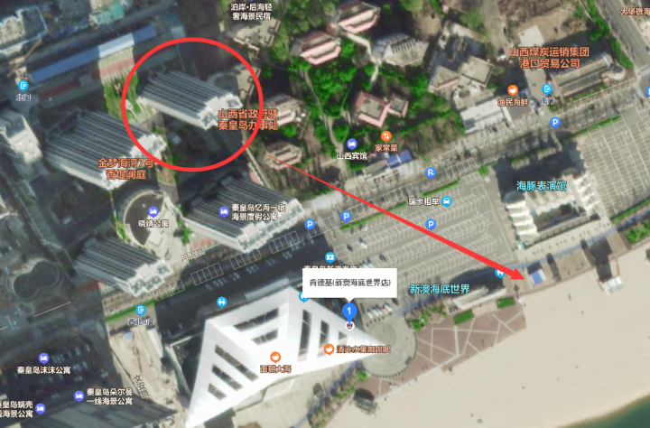
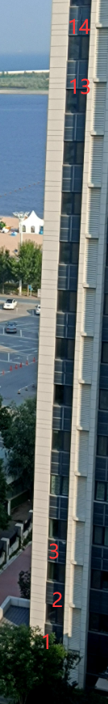
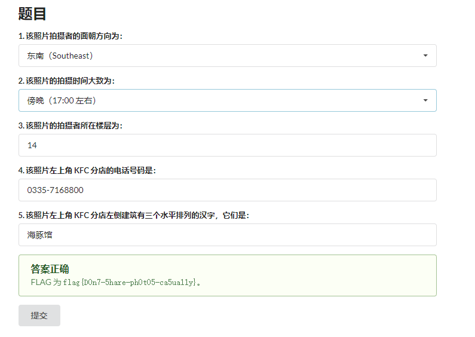

# 旅行照片

> 你的学长决定来一场说走就走的旅行。通过他发给你的照片来看，他应该是在酒店住下了。

> 从照片来看，酒店似乎在小区的一栋高楼里，附近还有一家 KFC 分店。突然，你意识到照片里透露出来的信息比表面上看起来的要多。

> 请观察照片并答对全部 5 道题以获取 flag。注意：图片未在其他地方公开发布过，也未采取任何隐写措施（通过手机拍摄屏幕亦可答题）。

GeoGuessr题。

一共有5问。

突破口是蓝色的KFC。直接搜索 `蓝色 KFC`：

 在*红书内可以找到地点位于**秦皇岛新澳海底世界**。

打开百度地图：

查看街景：

对比*红书上的照片，可以确定超市被KFC取代了。（SN2是吧？）

所以第五问的答案为 `海豚馆` 。

 依然在百度地图里拿到电话：

第四问答案为 `0335-7168800` 。

这里可以发现地图定位不正确，应该以海豚馆旁边为准。

打开卫星图，根据停车场与红房子的位置确认楼栋与方向：

所以第一问答案为 `东南` 。

 根据旁边楼房平齐的楼层，可以推测第三问答案为 `14` 。

根据地上的影子及拍摄角度，推测第二问应该为 `下午` 或 `傍晚`。

拿到flag `flag{D0n7-5hare-ph0t05-ca5ua11y}` 。