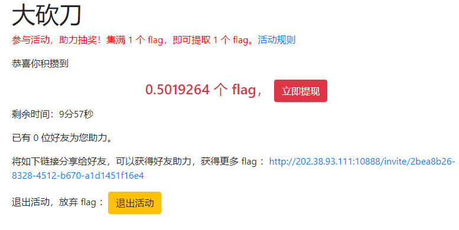
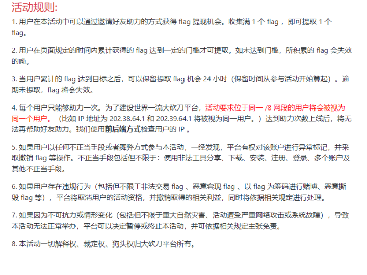
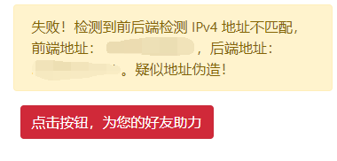
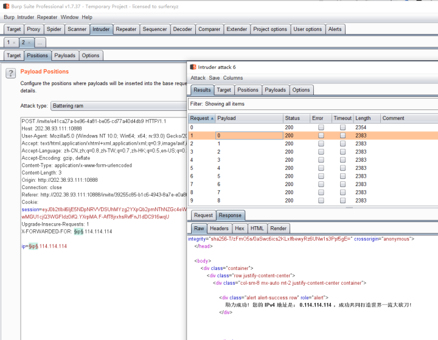

# FLAG 助力大红包

> “听说没？【大砍刀】平台又双叒做活动啦！参与活动就送 0.5 个 flag 呢，攒满 1 个 flag 即可免费提取！” 
>
> “还有这么好的事情？我也要参加！” 
>
> “快点吧！我已经拿到 flag 了呢！再不参加 flag 就要发完了呢。” 
>
> “那怎么才能参加呢？” 
>
> “这还不简单！点击下面的链接就行”

白底白字（

neta并夕夕。

查看助力的网络请求，发现会将ip地址作为payload POST给服务器。如果修改这个地址，会报错：

最开始打算用代理池，试了一天之后，结果发现要找到全部256种 /8网段的免费节点太难了。（而且解出人数也表明这是一道简单题）

于是想到了header中的 `x-forwarded-for` 字段。

打开Burp Suit，在 `Proxy` 中拦截请求，扔到 `Intruder` 中构建：

 每次间隔两秒，不然会出错。

Python中的 `requests` 库好像会把自己的ip追加到 `x-forwarded-for` 字段中去，导致报错。

回到网页中提取得到flag。