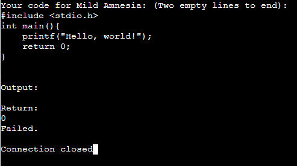
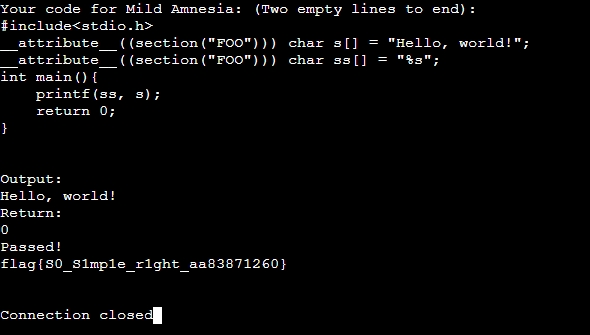

# Amnesia

> 你的程序只需要输出字符串 `Hello, world!`（结尾有无换行均可）并正常结束。 
>
> 编译指令：`gcc -O file.c -m32` 
>
> 运行指令：`./a.out` 
>
> 编译器版本：Docker 镜像 `ustclug/debian:10` 中 `apt update && apt -y upgrade && apt install -y gcc=4:8.3.0-1 gcc-multilib=4:8.3.0-1` 的版本 
>
> **轻度失忆** 
>
> 编译后 ELF 文件的 `.data` 和 `.rodata` 段会被清零。
>
> **记忆清除**
>
> 编译后 ELF 文件的 `.text` 段会被清零。

尽管没学过编译原理，但是极高的完成人数代表第一问是一道简单题。

搜索 `elf .data .rodata` ，可以找到不少讲解。

粗略地读一遍，`.data` 字段放置非零的全局变量，只读的 `.rodata` 放置非零的全局常量。所以如果只是简单的 `printf("Hello, world!");` 的话，这个字符串肯定要被清理掉的。



所以解法就很明显了，要把字符串扔到另一个字段去。 

搜索 `c section 变量` ，可以找到 `__attribute__((section("114514")))` 这个魔法参数。并且还要把字符串设为全局变量。

```c
#include<stdio.h>
__attribute__((section("FOO"))) char s[] = "Hello, world!";
__attribute__((section("FOO"))) char ss[] = "%s";
int main()
{
    printf(ss, s);
    return 0;
}
```



得到flag `flag{S0_S1mp1e_r1ght_aa83871260}` 。

第二问要请 `.text` 字段了，不会做，摸了（