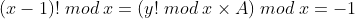

## Easy RSA

> 自从 [Hackergame 2018 公然揭露了大整数可以被神童口算分解的事实](https://github.com/ustclug/hackergame2018-writeups/tree/master/official/RSA_of_Z#解法-1)，RSA 在 hackergame 中已经只能处于低分值的地位了。如果不在其名称前面加上 Easy 这个单词，似乎就会显得完全对不起其他题目。 
>
> 更何况，在本题的附件中，你还获得了构造 p 和 q 的方式。数理基础扎实的你应该可以轻松解决这些问题吧。

```python
import math
import sympy
from Crypto.Util.number import *

e = 65537


def get_p():
    x = 11124440021748127159092076861405454814981575144744508857178576572929321435002942998531420985771090167262256877805902135304112271641074498386662361391760451
    y = 11124440021748127159092076861405454814981575144744508857178576572929321435002942998531420985771090167262256877805902135304112271641074498386662361391661439
    value_p = sympy.nextprime((math.factorial(y)) % x)  # Hint：这里直接计算会溢出，请你仔细观察 x 和 y 的特征
    return value_p


def get_q():
    value = [getPrime(256)]
    for i in range(1, 10):
        value.append(sympy.nextprime(value[i - 1]))
    print("value[-1] = ", value[-1])
    # value[-1] = 80096058210213458444437404275177554701604739094679033012396452382975889905967
    n = 1
    for i in range(10):
        n = n * value[i]
    q = getPrime(512)
    value_q = pow(q, e, n)
    print("value_q = ", value_q)
    # value_q = 5591130088089053683141520294620171646179623062803708281023766040254675625012293743465254007970358536660934858789388093688621793201658889399155357407224541324547522479617669812322262372851929223461622559971534394847970366311206823328200747893961649255426063204482192349202005330622561575868946656570678176047822163692259375233925446556338917358118222905050574458037965803154233167594946713038301249145097770337253930655681648299249481985768272321820718607757023350742647019762122572886601905212830744868048802864679734428398229280780215896045509020793530842541217790352661324630048261329493088812057300480085895399922301827190211956061083460036781018660201163819104150988531352228650991733072010425499238731811243310625701946882701082178190402011133439065106720309788819
    return sympy.nextprime(q)

# this destroyes the rsa cryptosystem
p = get_p()
q = get_q()

m = int.from_bytes(open("flag.txt", "rb").read(), "big")
c = pow(m, e, p * q)
print("c = ", c)
# c = 110644875422336073350488613774418819991169603750711465190260581119043921549811353108399064284589038384540018965816137286856268590507418636799746759551009749004176545414118128330198437101472882906564195341277423007542422286760940374859966152871273887950174522820162832774361714668826122465471705166574184367478
```

## p

先看 `get_p()` 。 

目标是求出 `(math.factorial(y)) % x` 。易知 `x` 和 `y` 都是一个大素数（可以用 `sympy.nextprime(x - 1) - x` 来验证）。

这么大的数求阶乘是非常难的。搜索 `大数 阶乘 取模` ，可以找到关键词 `Fanslog` 。继续搜索，可以找到[一道算法题](http://acm.hdu.edu.cn/showproblem.php?pid=6608)：


搜索这道题的题解，可以找到一个非常重要的定理——威尔逊定理：


根据模的乘法分配律，可以将上式写成：

![\begin{align} (x-1)! \; mod \; x &= [y!\times(y+1)\times(y+2)\times...\times(x-1)] \; mod \; x \notag \\ &= \{y! \; mod \; x \times [(y+1)\times(y+2)\times...\times(x-1)] \; mod \; x\} \; mod \; x \notag \\ &=  \left[y! \; mod \; x \times \left(\prod_{i=y+1}^{x-1}i \right) \; mod \; x \right] \; mod \; x \notag \\ &= -1 \notag \end{align}](img/3.png)

令：


利用代码可以很方便地求出A：

```python
A = 1
for i in range(y + 1, x):
    A *= i
    A = A % x
# A = 8746795902355604812447523802504892426075916296488249289524877759854565745071841420897295384854172978346488552200567560908676165067148510503685652473230597
```

带入：



因此需要求A对于x的逆元B，满足：（为了防止和幂混淆，这里用B代替)


带入可得：

![\begin{align} (y! \times A \times B) \; mod \; x &= [(-1) \times B] \; mod \; x \notag \\ y! \; mod \; x &= [(-1) \times B] \; mod \; x \notag \\ y! &\equiv (-1) \times B \; (mod \; x) \notag \end{align}](img/8.png)

问题就来了，怎么求逆元呢？

由费马小定理：


易知：


带入，可得：


写成Python就是：

```python
y_factorial = ((-1) * pow(A, x-2, x)) % x
# y_factorial = 10569944080090591401315432556965818857327680380269154543273468441025963038065648915158194147019839932524599260058098616377893091051396090650574162446875193
```

这样就能得到 `p` 了：

```python
p = sympy.nextprime(y_factorial)
# p = 10569944080090591401315432556965818857327680380269154543273468441025963038065648915158194147019839932524599260058098616377893091051396090650574162446875263
```

## q

接下来看 `get_q()` 。 

```python
value = [getPrime(256)]
for i in range(1, 10):
    value.append(sympy.nextprime(value[i - 1]))
print("value[-1] = ", value[-1])
# value[-1] = 80096058210213458444437404275177554701604739094679033012396452382975889905967
```

这一段取了一个素数，将它和它后面的九个素数存在了一个数组里，并输出了最后一项。

这样解法就很简单了：在 `value[-1]` 的前面一点的地方随便取一个数，我设为 `_value`。再向后取十个素数，把最后一项与 `value[-1]` 相减。 如果不为零就前后调整 `_value`。

```python
v = 80096058210213458444437404275177554701604739094679033012396452382975889905967
_value = v - 1000

value = [_value]
for i in range(1, 11):
    value.append(sympy.nextprime(value[i - 1]))
assert(value[-1]-v == 0)
value = value[1:]
```

然后题中用十个素数的积 `n` 和 `e` 作为公钥，对 `q` 的前体进行多因子RSA加密。

所以显然是要找多因子RSA的欧拉函数 `φ(n)` 的求法。 其实依然是把每一项减一再乘起来：


```python
phi = 1
for i in range(10):
    phi = phi * (value[i] - 1)
```

再求个模反，就能得到私钥 `d` 了。 然后用RSA解密得到 `q` 的前体。 

```python
def egcd(a, b):
    if a == 0:
        return (b, 0, 1)
    else:
        g, y, x = egcd(b % a, a)
        return (g, x - (b // a) * y, y)


def modinv(a, m):
    g, x, y = egcd(a, m)
    if g != 1:
        raise Exception('modular inverse does not exist')
    else:
        return x % m

d = modinv(e, phi)
_q = pow(value_q, d, n)
q = sympy.nextprime(_q)
```

## flag

最后再重复一遍RSA解密，用 `Crypto.Util.number.long_to_bytes()` 还原，得到flag `flag{CRYPT0_1s_Interesting!}`。