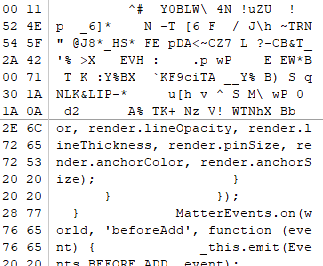

# 阵列恢复大师

> 2021 年 10 月 3 日，阴转小雨。 
>
> 你发现你运行在实验室机器上的炼丹脚本挂了。 
>
> 「好好的国庆假期，怎么我还得来改程序……」收到邮件通知后，你登录了机器，看到的却是一大堆 Input/Output Error，回过神来才发现，放数据的阵列好像出了问题。 
>
> 「完了！上面的数据我从来没有备份过！这下赶不上 DDL 发不了 paper 了！」你赶忙跑到机房，检查了一下阵列的情况——看起来盘没坏，都能读，只是可能是受到神秘宇宙射线（误）的影响，阵列的管理页面看不了，每块盘的 RAID 元数据好像也全不见了，更要命的是，你忘了当初组阵列时候盘的顺序和其他的参数。怎么恢复数据呢？上网搜索一下，好像得花不少钱。但你听说你的同学最近在搞信息什么大赛——或许可以让他们试试？

下载下来是两个压缩包。RAID 0 的压缩包中有八个镜像文件，RAID 5的有五个。

搜索 `RAID` ，可以查到一些资料。 

RAID 0 没有数据冗余，每个条带都用来保存数据，因此坏一块盘就直接GG。以题中八块磁盘为例的话，写入顺序为：

| 磁盘0 | 磁盘1 | 磁盘2 | 磁盘3 | 磁盘4 | 磁盘5 | 磁盘6 | 磁盘7 |
| ----- | ----- | ----- | ----- | ----- | ----- | ----- | ----- |
| 0     | 1     | 2     | 3     | 4     | 5     | 6     | 7     |
| 8     | 9     | 10    | 11    | 12    | 13    | 14    | 15    |

RAID 5 中，每个条带中有一块盘用来保存校验数据，并且相邻条带的校验盘都不同，写入顺序为：

| 磁盘0 | 磁盘1 | 磁盘2 | 磁盘3 | 磁盘4 |
| ----- | ----- | ----- | ----- | ----- |
| 0     | 1     | 2     | 3     | 校验  |
| 4     | 5     | 6     | 校验  | 7     |
| 8     | 9     | 校验  | 10    | 11    |
| 12    | 校验  | 13    | 14    | 15    |
| 校验  | 16    | 17    | 18    | 19    |

显然RAID 5 的结构更简单一点，先做RAID 5。

## RAID 5

搜索 `raid 恢复` ，可以找到一个名为 `WinHex` 的恢复软件。

导入镜像后，选择 `专业工具` -> `将镜像文件转换为磁盘` ，`每扇区字节数` 保持默认的512，这样每512字节就会出现一个扇区（section）的分隔线。


随便拖一下滚动条，可以找到一些可读的代码，可以用来判断块（block）的大小。

以 `QjTgmgmwXAM.img` 文件为例，找到显示为乱码的校验块与可读块之间的分界线，记下扇区位置（21376）：



往前找到可读区与乱码的分界线，记下扇区位置（21248）：


相差128个扇区，每个扇区512字节，也就是一个块64 KB。

现在就可以根据检验块的位置判断每个盘在阵列中的顺序了。

每个镜像都跳转到第21248扇区，可以发现 `60kE0MQisyY.img` 在21247扇区是乱码，而 `QjTgmgmwXAM.img` 在21248扇区是乱码，因此可以判断 `QjTgmgmwXAM.img` 是排在 `60kE0MQisyY.img` 之前的。 

重复一下，可以得到 `3D8qN9DH91Q.img` 排在 `QjTgmgmwXAM.img` 前，`3RlmViivyG8.img` 或 `IrYp6co7Gos.img` 排在 `3D8qN9DH91Q.img` 前（因为这两个都是乱码，可能是遇到了二进制文件）。于是再往前搜寻一下连续的代码段，可以发现在9472扇区 `3RlmViivyG8.img` 是乱码，9471扇区 `IrYp6co7Gos.img` 是乱码，因此 `3RlmViivyG8.img` 在前面。

现在得到了相对顺序，绝对顺序需要一点小技巧。

拖到第1扇区，可以发现 `60kE0MQisyY.img` 和 `3RlmViivyG8.img` 都出现了 `EFI PART` 字段，这是GPT的表头。这表明这两个镜像中，一个为磁盘0，一个为磁盘4。

再根据相对顺序，结果就出来了：

| 顺序            |
| :-------------- |
| 3RlmViivyG8.img |
| IrYp6co7Gos.img |
| 3D8qN9DH91Q.img |
| QjTgmgmwXAM.img |
| 60kE0MQisyY.img |

打开 `DiskGenius` ，使用 `磁盘` -> `打开虚拟磁盘文件` 导入镜像后，选择 `工具` -> `组建虚拟RAID` 。按顺序添加磁盘，`RAID类型` 选择 `RAID5 左同步` ， `块大小` 选择 `64 KB` 。点击确定后，就能看到原始文件了：


导出来，扔到Linux虚拟机里执行（windows下结果是完全不对的），拿到flag：


## RAID 0

RAID 0 依然可以分成同样的三步：确定块大小 -> 确定顺序 -> 组RAID。

RAID 0 中没有标志性的校验块了，于是只能根据上下文的连贯性判断。

先找到一个块与块的分界线，如 `RApjvIxRlu0.img` 的18176扇区：


往前跳转2的幂个扇区。从小往大试，先试个128个扇区（64 KB）：


发现是连贯的，说明块大小至少为128 KB。再往前跳128个扇区（第17920扇区），发现被截断了：


显然这不是一个文件的头部（这里应该是一个pdf文件的一部分），所以块大小为128 KB。

接下来就是痛苦的拼顺序了。可以发现 `ID7sM2RWkyI.img` 的第17919扇区是有内容的，而其它镜像都是空白。


分析上下文，`<< /A 489 ` 后应该接的是 `wlOUASom2fI.img` 的 `0 R ` ：


重复几次就能得到相对顺序。

而 `wlOUASom2fI.img` 的第1扇区有GPT的表头，因此绝对顺序为：

| 顺序            |
| --------------- |
| wlOUASom2fI.img |
| jCC60mutgoE.img |
| 1GHGGrmaMM0.img |
| 5qiSQnlrA4Y.img |
| d3Be7V0EVKo.img |
| eRL2MQSdOjo.img |
| RApjvIxRlu0.img |
| ID7sM2RWkyI.img |

这时候再扔 `DiskGenius` 里是行不通的，会识别不出来（因为挖了个坑）。

这里用 `WinHex` 组RAID。选择 `专业工具` -> `重组RAID` ，条带大小 填 `256` （个扇区）。


可以发现里面是有个XFS分区的（`DiskGenius` 识别不出）：


于是用 `WinHex` 导出img后，直接扔到Linux里挂载。

```bash
mkdir raid0
sudo mount -t xfs -o offset=1048576 raid0.img raid0
```

`-t xfs` 表示文件系统类型是 `XFS` ， `-o offset=1048576` 表示从1048576字节开始读（根据上图的2048*512）。

这时候 `raid0` 文件夹里就有咱们要的东西了：


拿到flag：


最后别忘了

```bash
sudo umount raid0
```