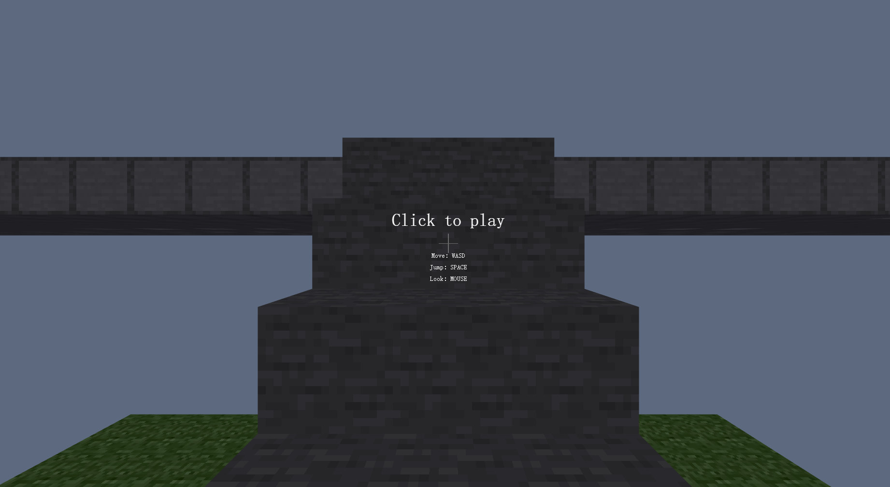
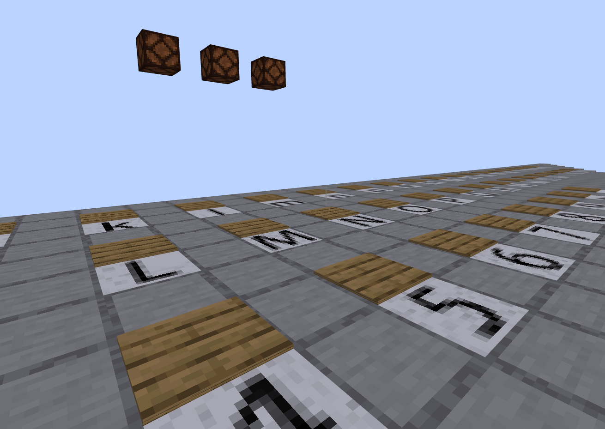

# minecRaft

> kk 同学很喜欢玩 Minecraft，他最近收到了一张 MC 地图，地图里面有三盏灯，还有很多奇奇怪怪的压力板。

> 但他发现这些灯好像不太符合 MC 电磁学（Red stone），你能帮他把灯全部点亮吗？

> 注：本题解法与原版 Minecraft 游戏无关。

点开是一个很像MC的界面：



地上每个字符对应一个压力板，上面还有三个红石灯。



作为一道web题，肯定是直接F12找js文件了（

找到 `miscs/flag.js` ，找到一段代码：

```javascript
function gyflagh(_0x111955) {
    const _0x50051f = _0x22517d;
    let _0x3b790d = _0x111955[_0x50051f(0x1a8)](_0x50051f(0x1b7));
    if (_0x3b790d === _0x50051f(0x1aa))
        return !![];
    return ![]; 
```

显然被混淆了。

一个小技巧是，把所有脚本扔到console里去，再输入混淆后的内容（如 `_0x50051f(0x1a8)` 即 `_0x22517d(0x1a8)` ，前面又有 `const _0x22517d = _0x2c9e;` ，所以输入 `_0x2c9e(0x1a8)` ），就能显示出原文（这里是 `'encrypt'` ）。

在js中，类型的方法函数可以看成实例的数组的一部分，如 `s.encrypt('123')` 等价于 `s['encrypt']('123')` 。

再把变量名美化一下， `gyflagh` 函数就能被写成：

```javascript
function gyflagh(in_str) {
    let out_str = in_str.encrypt('1356853149054377');
    if (out_str === '6fbde674819a59bfa12092565b4ca2a7a11dc670c678681daf4afb6704b82f0c')
        return true;
    return false;
}
```

这就很明了了，知道密钥、密文、加密方法，求明文。

整理后，脚本里一共七个函数：`gyflagh(arg1)` 、 `encrypt(arg1)` 、 `code(agr1, arg2)` 、`Str4ToLong(arg1)` 、 `LongToBase16(arg1)` 、 `Base16ToLong(arg1)` 、 `LongToStr4(arg1)` 。

后面四个两两互逆的可以不用管，重点是中间两个。

整理前：

```javascript
String['prototype'][_0x22517d(0x1a8)] = function (_0x6a2659) {
    const _0x13519e = _0x22517d
        , _0x267e12 = new Array(0x2)
        , _0x11a961 = new Array(0x4);
    let _0x1bf548 = '';
    plaintext = escape(this);
    for (var _0x485827 = 0x0; _0x485827 < 0x4; _0x485827++)
        _0x11a961[_0x485827] = Str4ToLong(_0x6a2659[_0x13519e(0x1a6)](_0x485827 * 0x4, (_0x485827 + 0x1) * 0x4));
    for (_0x485827 = 0x0; _0x485827 < plaintext[_0x13519e(0x1b8)]; _0x485827 += 0x8) {
        _0x267e12[0x0] = Str4ToLong(plaintext['slice'](_0x485827, _0x485827 + 0x4)),
            _0x267e12[0x1] = Str4ToLong(plaintext[_0x13519e(0x1a6)](_0x485827 + 0x4, _0x485827 + 0x8)),
            code(_0x267e12, _0x11a961),
            _0x1bf548 += LongToBase16(_0x267e12[0x0]) + LongToBase16(_0x267e12[0x1]);
    }
    return _0x1bf548;
}

function code(_0x167a71, _0x762113) {
    let _0x412874 = _0x167a71[0x0]
        , _0x3f9c14 = _0x167a71[0x1];
    const _0x540f95 = (0x52cfb2de + 0x4b67c6db)
        , _0x2bdc23 = _0x540f95 * 0x20;
    let _0x4f8e47 = 0x0;
    while (_0x4f8e47 != _0x2bdc23) {
        _0x412874 += (_0x3f9c14 << 0x4 ^ _0x3f9c14 >>> 0x5) + _0x3f9c14 ^ _0x4f8e47 + _0x762113[_0x4f8e47 & 0x3],
            _0x4f8e47 += _0x540f95,
            _0x3f9c14 += (_0x412874 << 0x4 ^ _0x412874 >>> 0x5) + _0x412874 ^ _0x4f8e47 + _0x762113[_0x4f8e47 >>> 0xb & 0x3];
    }
    _0x167a71[0x0] = _0x412874,
        _0x167a71[0x1] = _0x3f9c14;
}
```

整理后：

```javascript
String.prototype.encrypt = function (key) {
    let
        plaintext_long = new Array(2),
        key_long = new Array(4);
    let rst = "";
    let plaintext = escape(this);
    for (var i = 0; i < 4; i++)
        key_long[i] = Str4ToLong(
            key.slice(i * 4, (i + 1) * 4)
        );
    for (var i = 0; i < plaintext.length; i += 8) {
        plaintext_long[0] = Str4ToLong(plaintext.slice(i, i + 4));
        plaintext_long[1] = Str4ToLong(plaintext.slice(i + 4, i + 8));
        code(plaintext_long, key_long);
        rst += LongToBase16(plaintext_long[0]) + LongToBase16(plaintext_long[1]);
    }
    return rst;
}

function code(plaintext_long, key_long) {
    let plaintext_long0 = plaintext_long[0],
        plaintext_long1 = plaintext_long[1];
    let counter = 0;
    while (counter != 2654435769 * 32) {
        plaintext_long0 += (((plaintext_long1 << 4) ^ (plaintext_long1 >>> 5)) + plaintext_long1) ^ (counter + key_long[counter & 3]);
        counter += 2654435769;
        plaintext_long1 += (((plaintext_long0 << 4) ^ (plaintext_long0 >>> 5)) + plaintext_long0) ^ (counter + key_long[(counter >>> 11) & 3]);
    }
    (plaintext_long[0] = plaintext_long0), (plaintext_long[1] = plaintext_long1);
}
```

依葫芦画瓢，很轻松就能写出逆函数：

```javascript
function decode(plaintext_long, key_long) {
    let plaintext_long0 = plaintext_long[0],
        plaintext_long1 = plaintext_long[1];
    let counter = 2654435769 * 32;
    while (counter != 0) {
        plaintext_long1 -= (((plaintext_long0 << 4) ^ (plaintext_long0 >>> 5)) + plaintext_long0) ^ (counter + key_long[(counter >>> 11) & 3]);
        counter -= 2654435769;
        plaintext_long0 -= (((plaintext_long1 << 4) ^ (plaintext_long1 >>> 5)) + plaintext_long1) ^ (counter + key_long[counter & 3]);
    }
    (plaintext_long[0] = plaintext_long0), (plaintext_long[1] = plaintext_long1);
}

String.prototype.decrypt = function (key) {
    let cipher_long = new Array(2);
    let key_long = new Array(4);
    let rst = '';
    let ciphertext = escape(this);
    for (var i = 0; i < 4; i++)
        key_long[i] = Str4ToLong(
            key.slice(i * 4, (i + 1) * 4)
        );
    for (var i = 0; i < ciphertext.length; i += 16) {
        cipher_long[0] = Base16ToLong(ciphertext.slice(i, i + 8));
        cipher_long[1] = Base16ToLong(ciphertext.slice(i + 8, i + 16));
        decode(cipher_long, key_long);
        rst += LongToStr4(cipher_long[0]) + LongToStr4(cipher_long[1]);
    }
    return rst;
}
```

也扔console里。输入 `'6fbde674819a59bfa12092565b4ca2a7a11dc670c678681daf4afb6704b82f0c'.decrypt('1356853149054377')` ，得到结果 `McWebRE_inMlnCrA1t_3a5y_1cIuop9i` 。

flag为 `flag{McWebRE_inMlnCrA1t_3a5y_1cIuop9i}` 。

------

当时搜索 `2654435769` ，发现是一个魔法数，常用于散列函数中。

官方题解提到： 

> ……其实有经验的选手在看到`0x9e3779b9`就已经警觉了……这里其实是一个 TEA 加密……

啥？TEA？你在说三乙胺吗？？（（