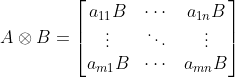

# p😭q

> 学会傅里叶的一瞬间，悔恨的泪水流了下来。
>
> 当我看到音频播放器中跳动的频谱动画，月明星稀的夜晚，深邃的银河，只有天使在浅吟低唱，复杂的情感于我眼中溢出，像是沉入了雾里朦胧的海一样的温柔。
>
> 这一刻我才知道，耳机音响也就图一乐，真听音乐还得靠眼睛。

neta耳机梗。

可以说是这届hackergame最简单的一道题了（

题目的附件给了从MP3生成GIF图片的源码：

```python
from array2gif import write_gif  # version: 1.0.4
import librosa  # version: 0.8.1
import numpy  # version: 1.19.5


num_freqs = 32
quantize = 2
min_db = -60
max_db = 30
fft_window_size = 2048
frame_step_size = 512
window_function_type = 'hann'
red_pixel = [255, 0, 0]
white_pixel = [255, 255, 255]
y, sample_rate = librosa.load("flag.mp3")  # sample rate is 22050 Hz

spectrogram = (numpy.around(librosa.power_to_db(librosa.feature.melspectrogram(y, sample_rate, n_mels=num_freqs,
               n_fft=fft_window_size, hop_length=frame_step_size, window=window_function_type)) / quantize) * quantize)

gif_data = [numpy.kron(numpy.array([[red_pixel if freq % 2 and round(frame[freq // 2]) > threshold else white_pixel for threshold in list(range(
    min_db, max_db + 1, quantize))[::-1]] for freq in range(num_freqs * 2 + 1)]), numpy.ones([quantize, quantize, 1])) for frame in spectrogram.transpose()]

write_gif(gif_data, 'flag.gif', fps=sample_rate/frame_step_size)
```

## 分析

因为用了大量魔法语句，源码非常简短。但只要认真分析一下，还是很好理解的。（而且咱们学化学的都挺有耐心的）

既然是要逆向，就得从后往前分析。

`write_gif(gif_data,'flag.gif', fps=sample_rate/frame_step_size)` ，浅显易懂，将一个数组写入文件中。

倒数第二行，是将音频数据转换为图像。 `gif_data` 的格式似乎难以理解，但是结合 `write_gif()` 的参数要求，可以推测出 `gif_data` 应该是个四维数组。第一维是帧，第二三维是长和宽，第四维是一个rgb数组。

这里放一张某一帧的图像，方便分析。


先看这个数组的最外层， `[ ... for frame in spectrogram.transpose()]` ，这是对每一帧做相同的转换操作。

再往内，`numpy.kron( numpy.array( ... ) , numpy.ones([quantize, quantize, 1]))` ，是一个克罗内克积。

矩阵A和B的克罗内克积为：



也就是说，`numpy.ones([2, 2, 1])` 代表将每行/列在它的旁边复制一次。在这里可以理解为，使每一帧的长宽变为原来的两倍（最后那个 1 是作用于rgb数组的，表示不影响）。

再往内，`[ ... for freq in range(num_freqs * 2 + 1)]` 。分析图像可以知道，横坐标代表着频率，纵坐标代表分贝。一共32个频率，`num_freqs * 2 + 1` 是为了在首尾及中间插入用来分隔的空白部分。

再往内， `[ ... for threshold in list(range(min_db, max_db +1, quantize))[::-1]]` 。对应每一行。注意这里步长为2，和上文的克罗内克积会抵消，同时也损失了奇数分贝的一些细节。

最后一部分， `red_pixel if freq % 2 and round(frame[freq //2]) > threshold else white_pixel` 。奇数列直接填充白色，偶数列分贝数大于 `threshold` 时填充红色。 

这样第二行就分析完了，再分析第一行。

`numpy.around( ... / quantize) * quantize` ，把数据取整。这里顺带把分贝数偶数化了。

内层的两个方法，`librosa.power_to_db()` 与 `librosa.feature.melspectrogram()` ，查询文档可以找到它们的逆方法：`librosa.db_to_power()` 与 `librosa.feature.inverse.mel_to_audio()` 。 

这样准备工作就做好了。

## 逆向

这里直接使用 `GIF Preview for mac` 逐帧导出图片，再配上人人都会用的 `cv2` 库，非常方便的将GIF转换为数组。 

```python
import cv2

frames = []
for i in range(587):
    im = cv2.imread(f'flag/flag-{i}.png', 0)
    frames.append(im)
```

这里使用了灰度模式，把rgb这一数组简化成了一个数。此时红色(255,0,0)被转化了147。

之后就是从图片中提取分贝数了。前3帧是空白，可以跳过。

```python
from typing import Counter

frames147 = []
for frame in frames[3:]:
    _ = []
    for i in range(num_freqs):
        column = frame[:,2 + i * 4] 
        c = Counter(column)
        c147 = c[147]*2 if 147 in c else 0
        _.append(c147 + min_db)
    frames147.append(_)
```

由于含有空白列和克罗内克积复制出来的列，每四列读一次数据。统计红色像素点的个数用了一个魔法方法 `typing.Counter()` 。

别忘了转置：

```python
import numpy as np

spectrogram = np.asarray(frames147).T
```

然后按之前的参数调用 `librosa` 的两个逆方法：

```python
import librosa

mp3 = librosa.feature.inverse.mel_to_audio(librosa.db_to_power(spectrogram), sr=sample_rate, n_fft=fft_window_size, hop_length=frame_step_size, window=window_function_type)
```

最后用 `soundfile` 库导出。 

```python
import soundfile as sf

sf.write('flag.wav', mp3, sample_rate, subtype='PCM_24')
```

打开文件，接下来是英语听力环节：

> The flag is: F-L-A-G six hundred thirty-four billion nine hundred seventy-one million two hundred forty-three thousand five hundred eighty-two.

得到flag `flag{634971243582}` 。 

